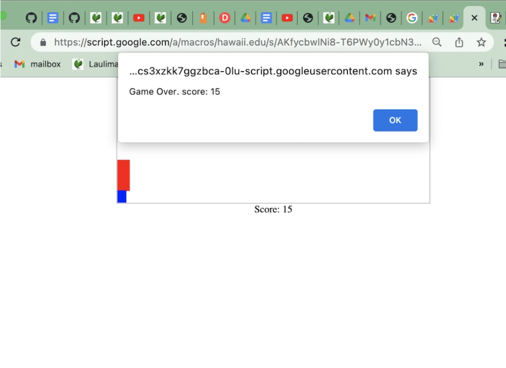

## Beginning of a Journey

One of the first exposures I had with JavaScript was through teaching intermediate and high school students over the summer. While middle school students were being entertained by Gartic Phone, my team and I were scrambling to find ways to teach the students JavaScript. As time went on, We breezed through the units of HTML and CSS which the students picked up quickly, and we needed to find a lesson plan for the javascript unit.. While on the search, I stumbled upon the infamous Dinosaur Game for google. I then had the genius idea of replicating it using JavaScript and CSS properties. We then proceeded to teach the students how to do so, which proved to be a small, but good introduction for middle schoolers. 

## Thoughts of the Day

Looking back at the code I wrote for that project, I can safely say that I can definitely do better. For example, not knowing better, I used the unholy “var” instead of “let” or const when I declared my variables. The project was a wonderful introduction for middle schoolers, but as a college student, there was still a lot more to learn, which is where ICS 314 comes into the picture.

## Learning the Basics

The big three in programming a website are HTML, CSS, and JavaScript. My websites mainly consisted of only HTML and CSS making the functionality of the website essentially bland seasoning. However, After going through the Free Code Camp and the athletic programming, I learned much more about javascript. For instance, I learned of the importance of functions and how they are used in websites. 

I know how much there is to learn, I’ve just started my journey, but I know how many opportunities there are in ICS 314, and I’m determined to take all of them.
