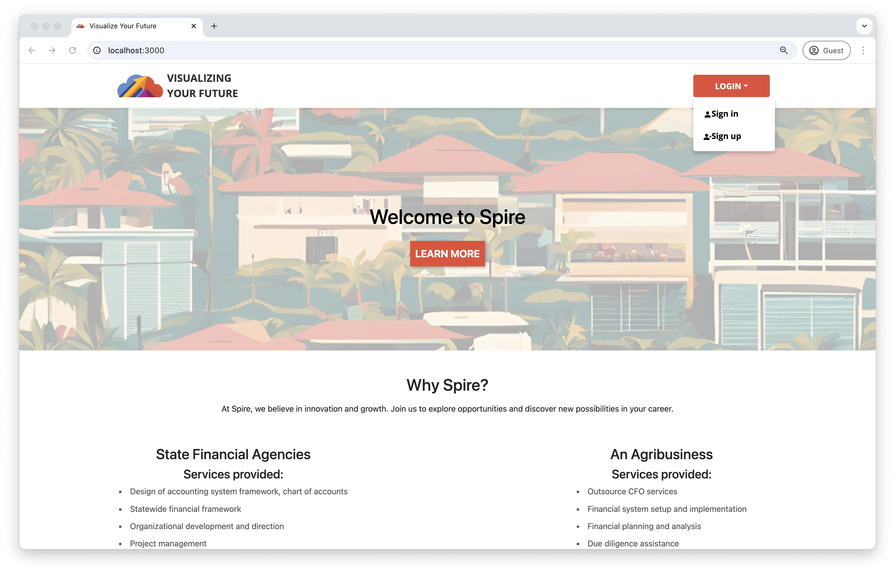

# ICS 414: Software Engineering II

This semester-long project involved working for Spire Hawaii, an independent strategic advisory and accounting firm that provides clarity and action to solve an organization's toughest challenges. "Visualizing Your Future" aims to deliver a robust web application for Spire Hawaii LLP's financial tools and databases, with the ultimate goal of enhancing their ability to meet clients’ accounting needs through impactful and easy-to-read visualizations of financial projections.

Please visit our website for an overview: <a href="https://visualizing-your-future.github.io/">https://visualizing-your-future.github.io/</a>

## Project Overview
The project team was composed of eight members, organized into five different groups, each focusing on improving Spire's existing accounting model. The existing model relied heavily on financial and strategic decision-making through Excel spreadsheets, which made management processes cumbersome. Our main goal was to create an interactive website capable of connecting seamlessly with these Excel spreadsheets, transforming the workflow into a more user-friendly and efficient digital experience.

The website was designed to bridge the gap between traditional spreadsheet-based accounting and a modern web-based interface, enabling users to visualize key financial insights quickly and easily.

## Technologies Used
We employed a range of technologies to develop the solution, including:
- GitHub: Used for version control, project management, and collaboration among the team members.
- React: The front-end library is used to build interactive user interfaces and ensure a smooth user experience.
- Meteor: Used to create the back-end environment and enable real-time data handling and seamless integration with other web technologies.

## Features Developed
The project incorporated several key features, including:
- **Landing Page:** A welcoming and informative entry point for users.
- **Data Input Page:** A section where users can easily upload and input financial data, simplifying the process of feeding data into the platform.
- **Visualization Page:** This is the centerpiece of the application, where users can generate visual representations of financial data, such as charts and graphs, providing intuitive insights into their business's financial health.

## Personal Contribution
Throughout this project, I played a role in the following areas:
- Front-End Development: I worked on the Landing Page, Account Settings Page, Navbar, and Footer. My focus was on building a responsive and intuitive user interface to ensure a smooth user experience. 
- Team Collaboration: Actively participated in most weekly meetings. Managed GitHub code reviews and contributed to the project management workflow. 

## Challenges and Solutions
**1. Understanding Financial Concepts and Excel Integration**
 
Our team's major challenge was gaining a thorough understanding of the financial concepts behind Spire's accounting tools. Initially, interpreting the details of financial spreadsheets and translating them into an application was daunting. To overcome this, we frequently met with Spire Hawaii's financial experts to better understand the specific requirements and how to accurately represent financial data through visualizations.

**2. Team Communication**
 
Communication was another challenge for a team of eight members working in different roles. To address this, we adopted Agile practices, holding regular stand-up meetings to ensure every team member was aligned and to facilitate swift problem-solving. We also extensively used Slack for instant communication and GitHub issues for tracking work progress and resolving blockers.

## Conclusion
Overall, "Visualizing Your Future" was a rewarding and insightful project that enabled us to apply our technical skills to a real-world problem. The combination of web technologies, finance, and teamwork provided an excellent opportunity to learn and grow. By the end of the project, we had developed a solution that successfully simplified the interaction with financial data, providing a smoother, more intuitive way for users to visualize their future financial projections.

## Next Steps
1. Security Improvements: Implement more secure authentication and encryption features.
2. Input Flexibility: Add support for additional formats to allow broader platform use.
3. Class Project Integration: Combine the solutions developed by the entire class into a unified platform. This effort would involve integrating features from different projects to create one cohesive website offering comprehensive financial tools.
