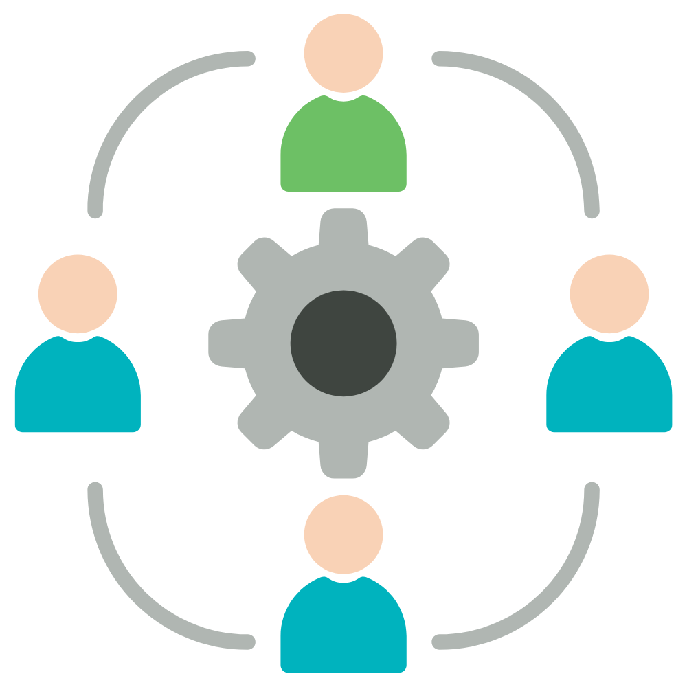

## Looking Back

Looking back at the beginning of the semester, I was at the beginning of learning how to make reactive websites using Meteor, and react seemed challenging. The benefit I had before starting ICS 314 was having some background in HTML and CSS. Finishing this semester, I gained one of the most informative and fundamental experiences in my college career. My favorite experience was learning Bootstrap and React which helps me to understand principles and concepts in the computer science industry such as ethics and coding standards.

## What is Software Engineering

What I learned through this class is how to grow my professional persona on LinkedIn and Github. Another objective I learned through this class is software engineering and athletic programming. Software engineering consists of designing, testing, evaluating, and maintaining computer software. Programs such as Youtube, Amazon, Chrome, and more need to be updated every so often to stay in the game of being well-known reliable tools for society. ICS 314 helps individuals understand the computer science industry by working together in creating and designing websites together.  

## Configuration Management

One of the phrases used often during our Flatmate Finder application was "The system was working yesterday! What happened?" This is where configuration management is so important. Software is written in a combination of modules and different languages which makes using it so complex. Configuration management helps alleviate or find possible solutions to the problem at hand. Something that came across as a problem that I brought up during coding was the frustration that we all had different copies of the website and had to merge them in Github. Some data conflicted or we weren't able to see updates in real-time. 

The idea of issue-driven project management would be to make a master copy of each file which means each developer should merge their changes to the master file for all developers on the team to see the changes. I found this concept a bit difficult but use being able to assign tasks helps focus on work and keeps things efficient.

## Ethics in Software Engineering

We know that ethics in any professional area is necessary. Many major corporations and even governmental agencies have questionable ethics. Software engineers should abide by either their own ethics or company ethics. The ideal goal of having ethics in software engineering is creating a safe environment for users regardless of race, gender, or background. The question of the century is, _Is the work I am doing benefit society or leads towards public demise?_

## Conclusion

Overall this class has shown me how to better myself in pursuing a computer science degree and learn to work with others transparently. Looking ahead, I intend on thinking and looking deeper into the future companies I intend to consider the company's ethnic boundaries with their users as well as the collar bite project management they have in store. 

