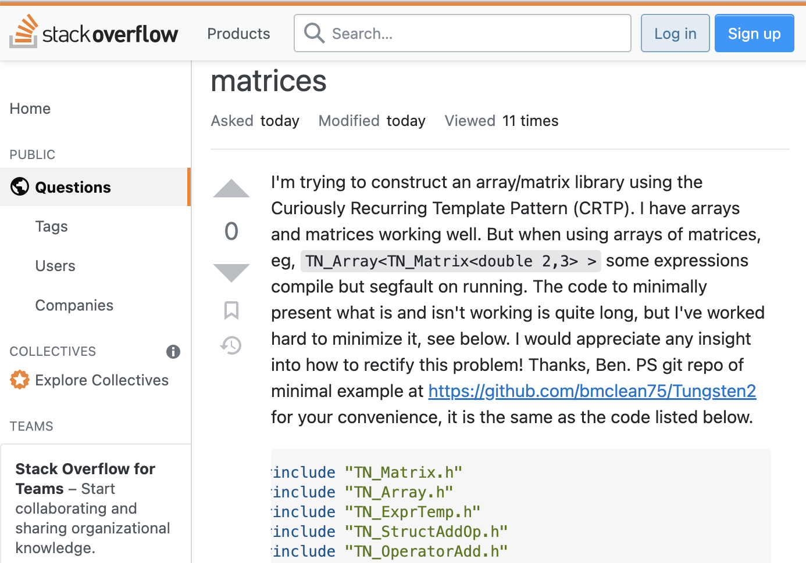

<h2>Google is great!</h2>

To some, a stupid question could be, "How do I tie a simple knot?" To a child learning basic motor functions, this is a question that they need to do know to an adult, we should already know how to tie a simple knot. Thankfully, google doesn't judge the type of questions we want to ask but if you ever watched [If Google Was a Guy](https://www.youtube.com/watch?v=Cxqca4RQd_M), I would say that no matter how hard he seemed to stay placant, you could feel a slight role of judgment rolling off his face. One of my favorite questions that I think is hard to understand without tone is "What song goes, meow, meow, meow...?" Google goes through so many questions a day and produce an answer that may or may not be the oneyou are looking for based on what you have asked. 

<h2>What is a stupid question?</h2>

In a coding perspective, Stack Overflow gives people the ability to interact with each other instaed of a machine making the types of question you ask more important. Stack Overlow cannot guess what you want from them exactly because these are humans responding to these questions. A wonderufl thing about StackOverflow is that if the question is to broad, they will ask you something along the lines if you are human in order to control the amount of usage and data.

<h2>What’s a smart question?</h2>

After reading through what I consider a smart question, I saw that they thanked a user for the insight the provided regarding the code. This user who asked a question also provided copyable code in order for people to assist him instead of screenshots. 

To take away from asking smart questions, you can potentially receive a positive outcome. Obviously, this does not mean you are guaranteed a positive or helpful response, but the goal of Stack Overflow is creating a space to ask and answer questions from people. A smart question comes with politeness and consideration as well as the resopndants who should respond when they have time and considerately. 
