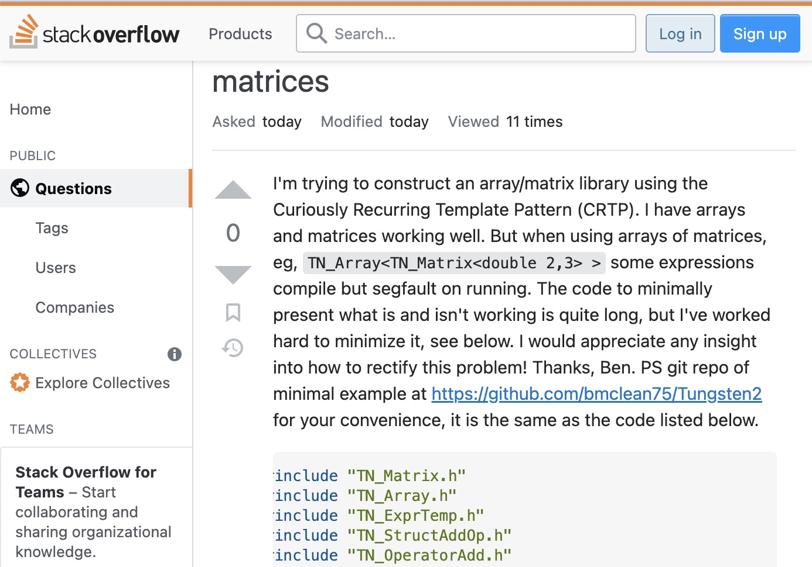

## Google is great!

To some, a stupid question could be, "How do I tie a simple knot?" To a child learning basic motor functions, this is a question that they need to know to an adult; we should already know how to tie a simple knot. Thankfully, Google doesn't judge the type of questions we want to ask, but if you ever watched [If Google Was a Guy](https://www.youtube.com/watch?v=Cxqca4RQd_M), I would say that no matter how hard he seemed to stay pleasant, you could feel a slight role of judgment rolling off his face.

One of my favorite questions that I think is hard to understand without tone is, "What song goes, meow, meow, meow...?" Google goes through so many questions a day and produces an answer that may or may not be the one you are looking for based on what you have asked.

  
 
 
 

## What is a stupid question?

From a coding perspective, Stack Overflow gives people the ability to interact with each other instead of a machine, making the types of questions you ask more important. Stack Overflow cannot guess exactly what you want from them because these humans respond to these questions.

A wonderful thing about StackOverflow is that if the question is too broad, they will ask you something along the lines of you are human in order to control the amount of usage and data.

 
 
 

## What’s a smart question?

After reading through what I consider a smart question, I saw that they thanked a user for their insight regarding the code. This user who asked a question also provided a copyable code for people to assist him instead of screenshots.

To take away from asking intelligent questions, you can receive a positive outcome. This does not mean you are guaranteed a positive or helpful response, but the goal of Stack Overflow is to create a space to ask and answer questions from people. An intelligent question also comes with politeness and consideration, as the respondents should respond considerately and when they have time.
