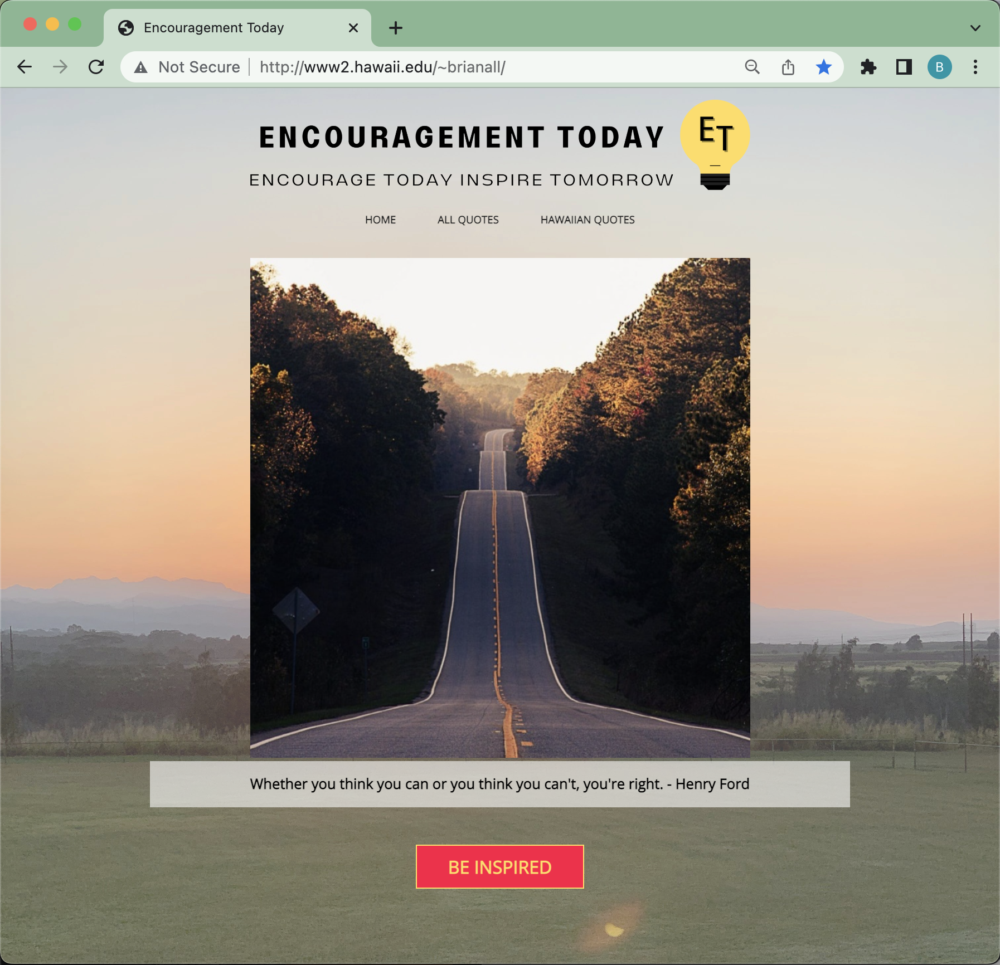

Encouragement today is a web application that I helped create as a summer research lab with LAVA Lab at UH Mānoa. The project helped me learn how to design and implement a web site.

In this project I gained experience with my first HTML, CSS, and JavaScript website that incorporates various Hawaiian quotes into this inspirational quote website. We used Microsoft Visual to create the website. 

This three-page HTML website contains CSS Framework for the user interface and design, and Javascript is used to reload the webpage and database for the quotes. 

 
 
Source: <a href="http://www2.hawaii.edu/~brianall/">EncouragementToday/encourage</a>
summer research lab with LAVA Lab at UH Mānoa.
