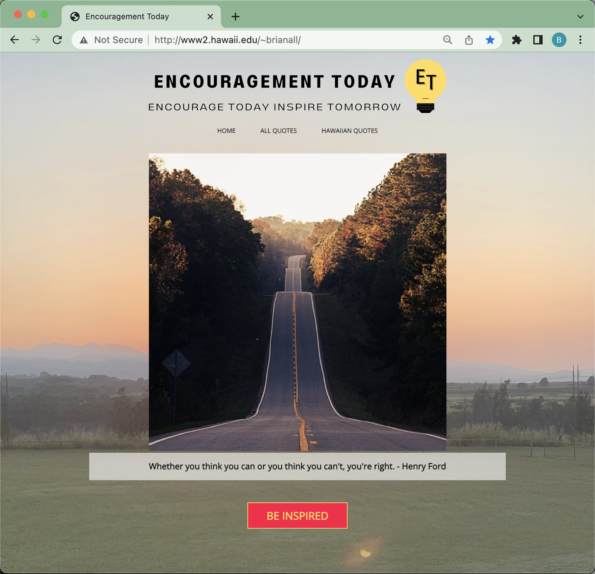

In the Summer of 2021, I participated in the Freshman Bridge Program hosted by the Native Hawaiian Science and Engineering Mentorship Program. This program connects students with research labs over the summer. I had the opportunity to learn from the Laboratory for Advanced Visualization & Applications (LAVA), and my research project was creating a website that inspires visitors.

In this project, I gained experience creating my first website using HTML, CSS, and JavaScript. The site features various Hawaiian quotes, making it an inspirational quote website. We used Microsoft Visual Studio to create the website. This three-page HTML website utilizes a CSS framework for the user interface and design, while JavaScript is employed to refresh the webpage and database for the quotes.

 
 
 
  
Source: <a href="http://www2.hawaii.edu/~brianall/">EncouragementToday/encourage</a>
