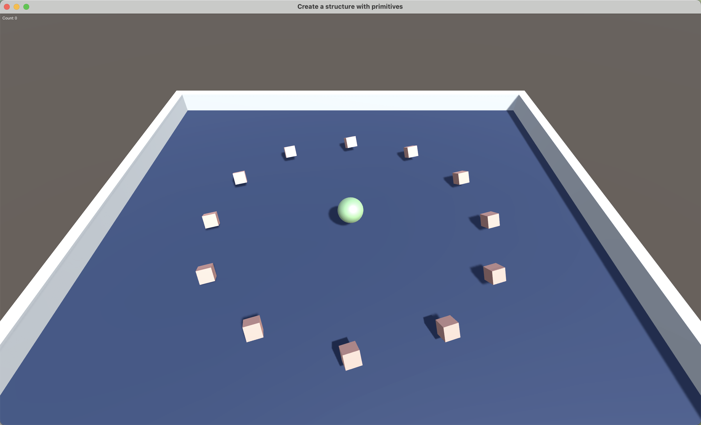

As a side project, I wanted to learn how to use Unity in order to create 3D models and games. I already enjoy creating things using animation and digital art but I wanted to learn how to use Unity and understand 3D dimensions. The idea behind the project was that I wanted to learn 3D animation in order to better understand how rendering, lighting, and computer systems work. This allowed me to go into C# for the first time which is a very similar language to Java and C/C++. 

Learning rigidbodies, colliders, and triggers were very interesting. I felt as if I was learning physics but on a computer. After creating a plane and sening my ball flying off it, I built borders in order to protect the ball. Ultimately, I found making my first game difficult but I feel like with more tweaks, I can make it look even better. 
