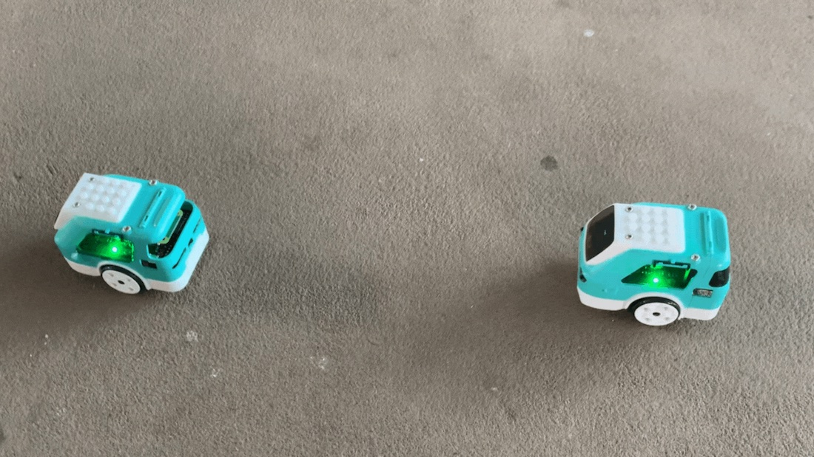

## AI4All Program Project
Computer vision is a field of AI that allows computers to understand what pictures and videos mean and take actions based on what it sees. This can be used to detect objects, collect data, or even perform some human tasks. This is why car manufacturers are starting to use computer vision in their cars. Self driving cars are growing in popularity because of their many uses and safety features. For example, Teslas have auto stop features if the car almost hits something. Our group wants to introduce self-driving cars by demonstrating how a mini car would use computer vision. 

The targeted audience for this project are those who are interested in learning about the applications of the codes we’ve been talking about into real life situations with the help of Zumi bots as our models. 

## Project Problem 
My group wanted to adress the problem that modern computer vision technologies is changing the way we view self-driving cars. The idea of a self-driving car is innovative but there are still features in these types of cars that are not perfected. What are ways to spread knowledge and demonstrate computer vision for the general public?

## Results for Object Detection
```cpp
zumi.mpu.calibrate_MPU() // calibrates the zumi's position
camera.start_camera() // starts zumi camera
   while 1 == 1:
      ir_readings = zumi.get_all_IR_data() // object detection sensors
      back_right_ir = ir_readings[2]
      back_left_ir = ir_readings[4]
      
      front_right_ir = ir_readings[0]
      front_left_ir = ir_readings[5]
      
      if front_left_ir < 100: 
        zumi.reverse()
      if back_right_ir < 50:
        zumi.forward()

```

  

Using IR sensors located in the front and back of the zumi helps identify the object's distance from another object. Using Zumi bots as a basis for identifying and locating objects, can be applied to industrial applications. Zumis creates a safe environment to test and implement a potential real world experience.


## Sources
Hemateja, A. V. N. M. (2021, December 21). Traffic sign dataset - classification. Kaggle. Retrieved November 2, 2022 <a href="https://www.kaggle.com/datasets/ahemateja19bec1025/traffic-sign-dataset-classification?resource=download">link</a>

Zumi. Robolink. (n.d.). Retrieved November 2, 2022 <a href="https://www.robolink.com/products/zumi">link</a>

What is Computer Vision? IBM. (n.d.). Retrieved November 2, 2022 <a href="https://www.ibm.com/topics/computer-vision">link</a> 

Glace, B. (2022, May 31). Autonomous vehicles are driving computer vision into the future. Plainsight. Retrieved November 2, 2022 <a href="https://plainsight.ai/autonomous-vehicles-computer-vision/#:~:text=Computer%20vision%20is%20at%20the,to%20safely%20navigate%20the%20road.">link</a> 
